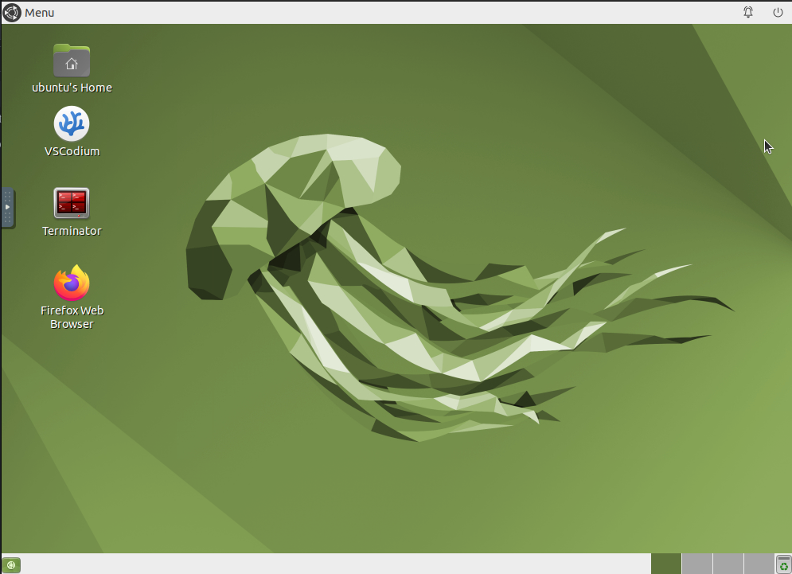
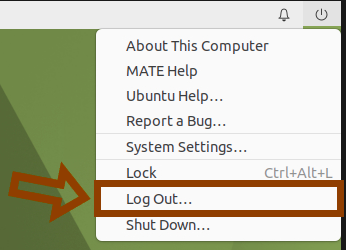

# Tooling for Summer/Winter Schools in Software Engineering for Robotics
This guide helps students and instructors set up the development and simulation environment for the school using Docker and ROS 2. It supports both Linux and non-Linux systems through containerization.

---

## Audience
 - Students: Use the prepared Docker environment to work on practical exercises.
 - Instructors: Customize the base Docker image with your own installation scripts for specific content.

---
Please, choose one of the following options:
- Option 1: Local installation (Linux only, Ubuntu 24.04)
- Option 2: Docker environment
---


# Option 1: Local installation (Linux only, Ubuntu 24.04)
If you're using Ubuntu 24.04 and prefer to install dependencies without Docker, you can install [ROS 2 Jazzy](https://docs.ros.org/en/jazzy/index.html) and run the provided setup script to configure the simulator locally.
```sh
cd ~/ros2_ws
./docker_infrastructure/docker/installation_scripts/simulator.sh
```

---
# Option 2: Docker environment

## Prerequisites:

### 1. Install Docker
 - Ubuntu users: Follow the official Docker installation guide for Ubuntu: [Docker Engine on Ubuntu](https://docs.docker.com/engine/install/ubuntu/)
 - Windows/macOS users (or Ubuntu with GUI): Install Docker Desktop: [Docker Desktop](https://www.docker.com/products/docker-desktop/)

If you are using Docker Desktop, you only need to **pull the image** by searching for `jmguerreroh/school:ubuntu24` in Docker Desktop’s search interface or by running the following command in the Terminal:
```bash
docker pull jmguerreroh/school:ubuntu24
```
When running the image, set 6080 as the host port in the Docker settings. Once it's running, continue with Step 6.

### 2. Clone the repository
Create a directory for the school environment and clone the repository:
```sh
mkdir ~/ros2_ws && cd ~/ros2_ws
git clone https://github.com/IntelligentRoboticsLabs/docker_infrastructure.git
```

## Docker infrastructure
### 3. (Optional) Install the NVIDIA Container Toolkit
To enable GPU Acceleration (Linux + NVIDIA) usage inside Docker
- Install the [NVIDIA drivers](https://ubuntu.com/server/docs/nvidia-drivers-installation).
- Install the [NVIDIA Container Toolkit](https://docs.nvidia.com/datacenter/cloud-native/container-toolkit/latest/install-guide.html). Execute the script:

```sh
cd ~/ros2_ws/docker_infrastructure/docker/
./nvidia_install.sh
```

- If you have an NVIDIA card in your system and it is configured with the proper drivers, you can execute the following command to switch between the integrated graphics card and the NVIDIA GPU:
```sh 
sudo prime-select nvidia
``` 

- After running prime-select, you will need to restart your system for the changes to take effect:
```sh 
sudo reboot
``` 

### 4. Download or build the Docker image
There are two ways to get the Docker image:
- 4.1. Option 1: Download Prebuilt Image from Docker Hub (**RECOMMENDED**):
```sh
docker pull jmguerreroh/school:ubuntu24
```

- 4.2. Option 2: Build image locally
Navigate to the Docker directory and build the Docker image:
```sh
cd ~/ros2_ws/docker_infrastructure/docker/
sudo docker buildx build --platform=linux/amd64  -t jmguerreroh/school:ubuntu24 -f Dockerfile .
```

### 5. Run Docker image:
Run the Docker image using the provided script:
```sh
./run_docker.sh
```

**Note: If you run this command without having the image, it will attempt to download it from Docker Hub as in step 4.1.

### 6. Access the Virtual Desktop
Open your browser and go to: http://localhost:6080/

You should see a full development desktop environment:



### 7. Managing the Docker container
- 7.1. If the container is currently running and you need to stop it, follow these steps:

    - First, log out of the Docker container environment in your browser:
        

    - Then, stop the Docker container using the following command
```sh
docker stop school
```

Your work is preserved unless you explicitly remove the container.

- 7.2. If it's stopped and you want to start it again:
```sh
docker start school
```

---
## Instructors
---
### 1. Before building the Docker image
Create an installation script with the necessary setup for your course and place it inside the `installation_scripts` folder.
- Follow steps 4.2 and 5 again to build the Docker image.
- Execute your script inside the Docker container. Once the Docker container is running, open a terminal inside the container and execute your script:

```sh
source /installation_scripts/your_script.sh
```

### 2. With a Docker image built and running
If the Docker image is already built and shared:
 - Upload your setup script to a public URL.
 - Ask students to download it using Firefox inside the Docker desktop and run it in the terminal.
